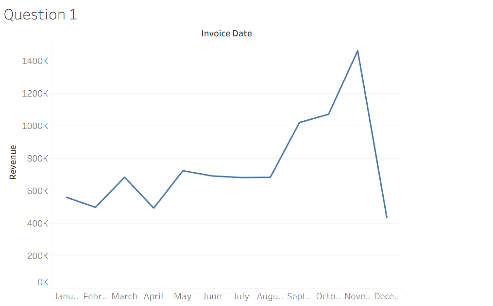
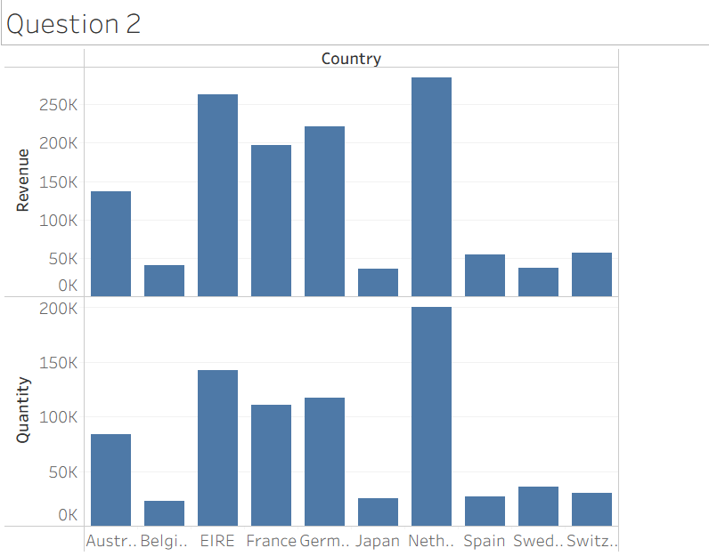
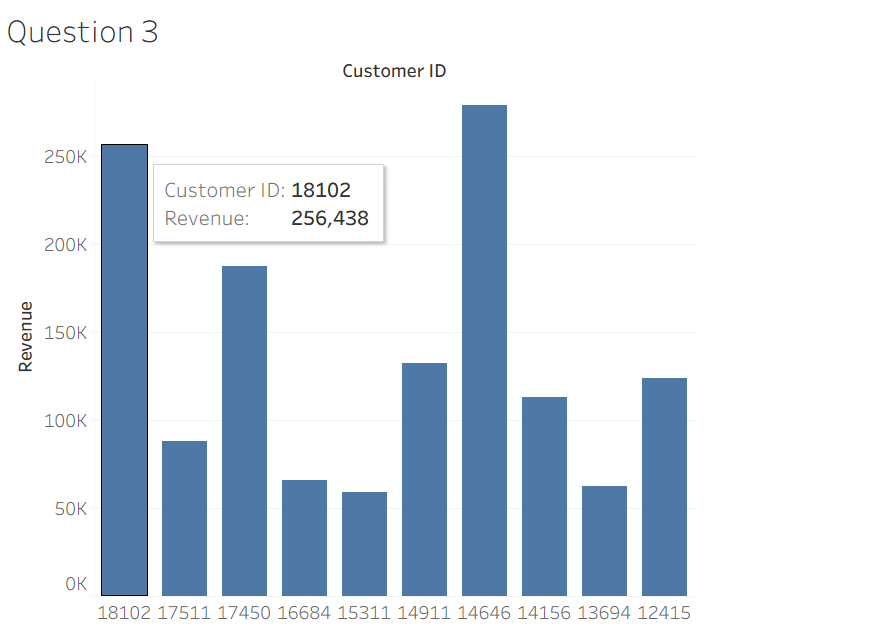
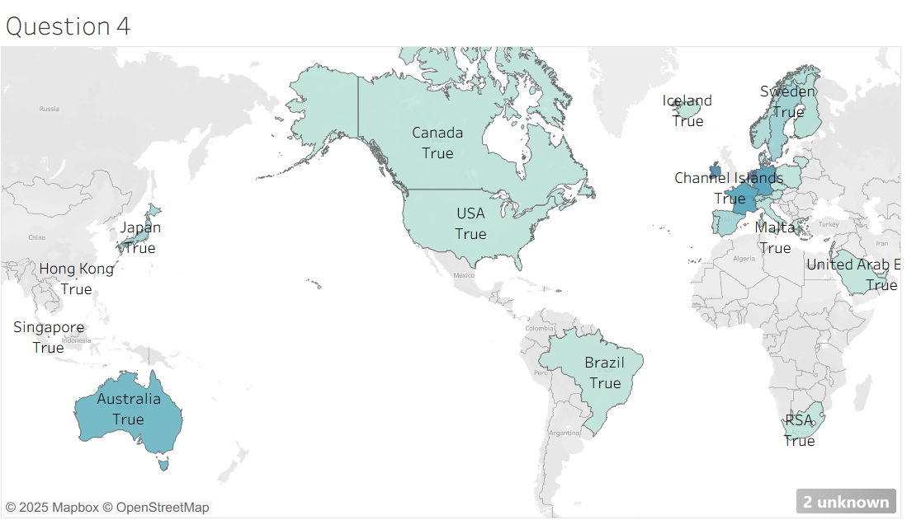

# Tata Data Visualisation: Empowering Business with Effective Insights (Forage)

This repository contains my work for the **Tata Data Visualisation Virtual Internship (Forage)**.  
The project focused on analyzing an online retail dataset, creating interactive visualizations, and presenting insights to support executive decision-making.

---

## Objectives

- Clean and prepare raw retail data for analysis
- Answer four business questions provided by the CEO and CMO
- Build clear and actionable dashboards using Power BI
- Present findings and recommendations based on the data

---

## Key Business Questions

1. **Monthly Revenue Trends (2011)**  
   - Identify seasonality patterns for forecasting
2. **Top 10 Countries (Excluding UK)**  
   - Compare revenue and quantity sold to find growth markets
3. **Top 10 Customers by Revenue**  
   - Target key customers for loyalty and retention
4. **Global Demand Map (Excluding UK)**  
   - Highlight regions for market expansion

---

## Tools & Skills Used
- **Power BI** for dashboards and visualization
- **Data Cleaning**: Removing duplicates, negative values, fixing dates
- **Data Analysis**: Trend identification, segmentation, market opportunity analysis
- **Data Storytelling**: Executive-level presentation

---

## Deliverables
- **Dashboards:**  
  
  
  
  

---

## Insights & Recommendations

- Strong **seasonality** with a peak in Sept–Nov
- High-growth markets outside UK: **Netherlands, Ireland, Germany, France, Australia**
- Top 10 customers account for a large revenue share → retention focus
- Expansion opportunities in **Americas, Asia, Africa**

---

## Author
**Kashish**  
B.Sc (Hons) Mathematics, University of Delhi  
Aspiring Data Analyst | Business Analyst

